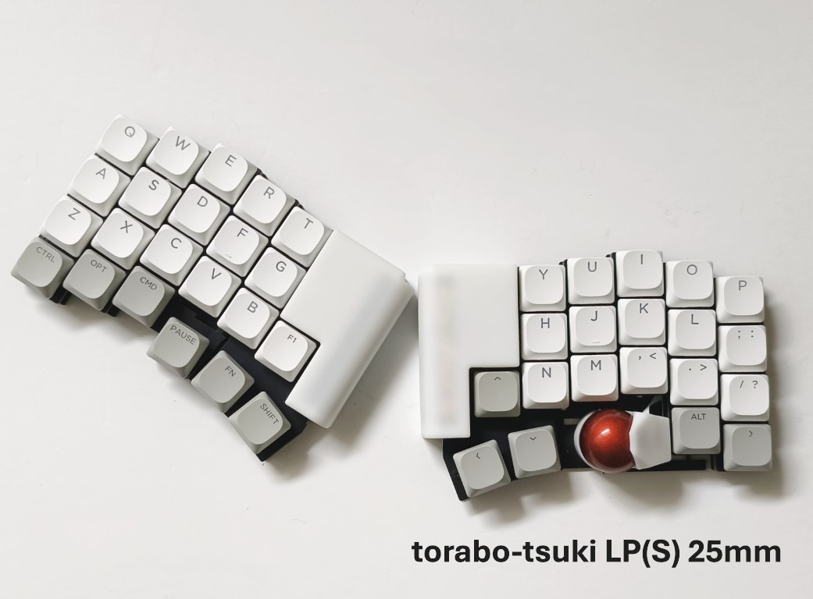
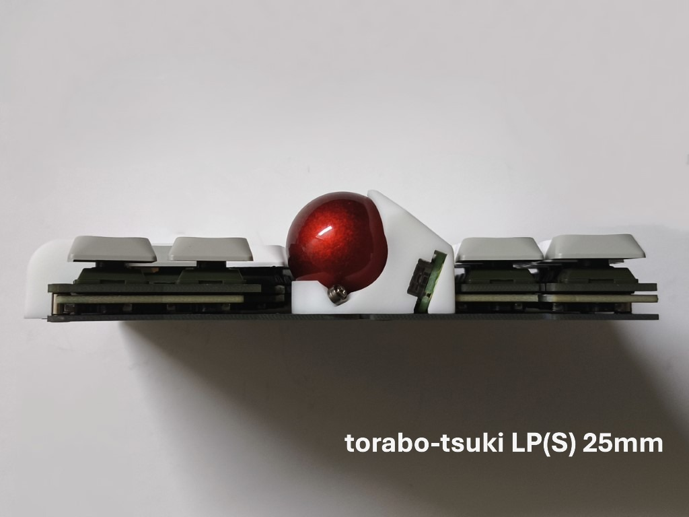
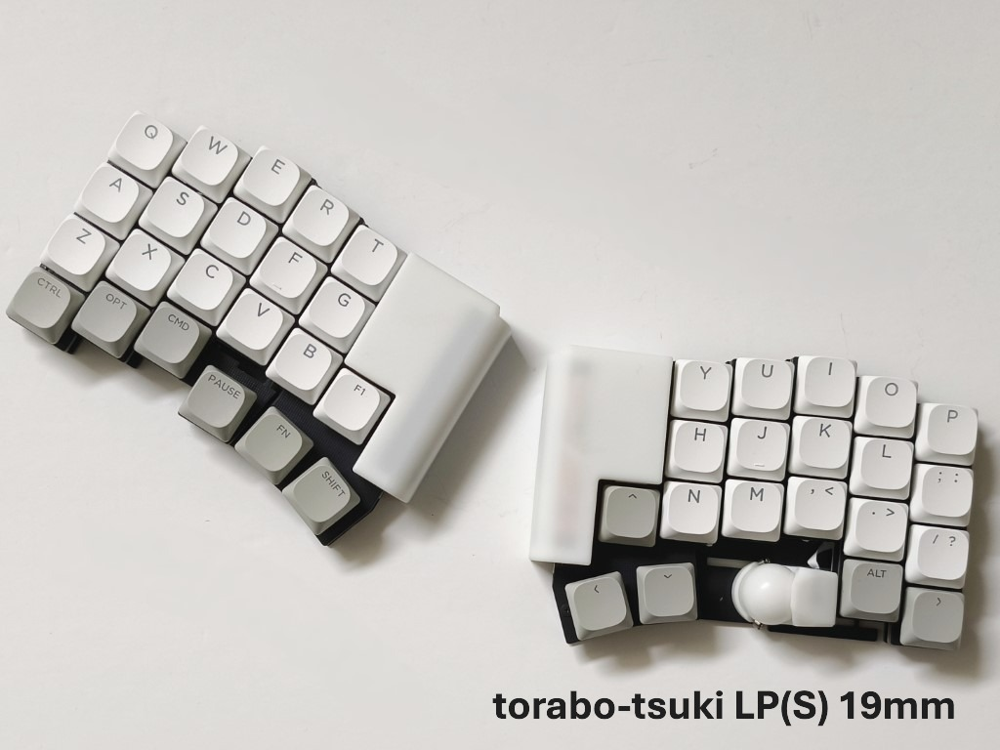
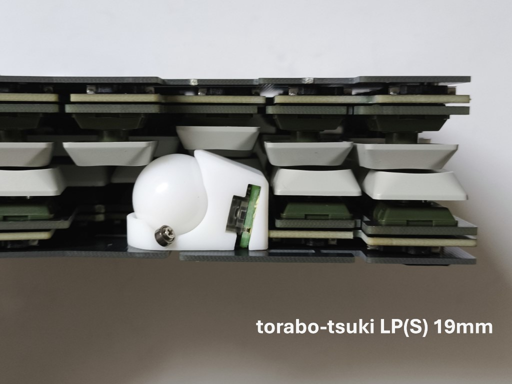

# torabo-tsuki LP

torabo-tsuki LP（トラボ付きLP）はトラックボール付きの無線分割キーボードキットです。

トラックボール(25 or 19mm)の高さを低く抑えることで、キーを打つときや持ち運びの邪魔になりにくくなっています。
無線接続に適したハードウェア・ソフトウェア構成により低消費電力を実現しており、連続して数か月間使用可能です。バッテリーは乾電池なので、残量や安全性を気にしながら定期的に充電する必要がありません。

[BOOTH](https://nogikes.booth.pm/items/7200248)にて販売中です。

**MX版の情報は[こちら](https://github.com/sekigon-gonnoc/torabo-tsuki)**

|||
|-|-|
|Sサイズ, 右25mmボール|Sサイズ, 右25mmボール|
|||
|Sサイズ, 右19mmボール|Sサイズ, 右19mmボール|

## [ビルドガイド](build-guide.md)

## 特徴

* 主要部品実装済み
  * ソケットやダイオードなどの部品は実装済みです。半田付けが必要な部品は電池ボックスだけです。
* 乾電池各1本で長期間動作
  * Ni-MH電池またはアルカリ電池で動作します。
  * 無線での使用にあわせて調整されたハードウェア・ソフトウェア構成により、乾電池でも数か月間利用できます。
* トラックボールの設置位置が調整可能
  * トラックボールを取り付ける位置を調整して、自分にとって一番操作しやすい位置に設置できます。ボールの高さを抑えたことでキーを打つときの邪魔になりにくなっています。
  * 左トラックボール、デュアルトラックボールにすることもできます。
  * トラックボールのサイズは25mmまたは19mmから選択できます。
* ZMK対応
  * keymap-editorやZMK Studioを使用して簡単にキーマップが変更できます。

## 使用上の注意

* 異臭や煙が出たときは、ただちに使用を中止して電源を切り電池を抜いてください。
* 電池から漏れた液が目に入った場合は、失明する恐れがあるのですぐにきれいな水でよく洗い、医師の診断を受けてください。
* 電池の+-を正しくセットしてください。
* 使い切った電池は速やかに取り出してください。
* 長期間使用しない場合は電池を取り出してください。

## 設計データについて

本リポジトリで基板・トラックボールケース・電池カバーの設計データを公開しています。

ライセンスにしたがって自由に利用していただいて構いませんが、問い合わせには対応しません。